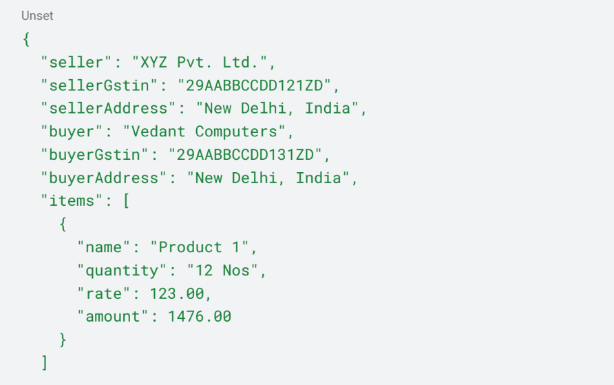
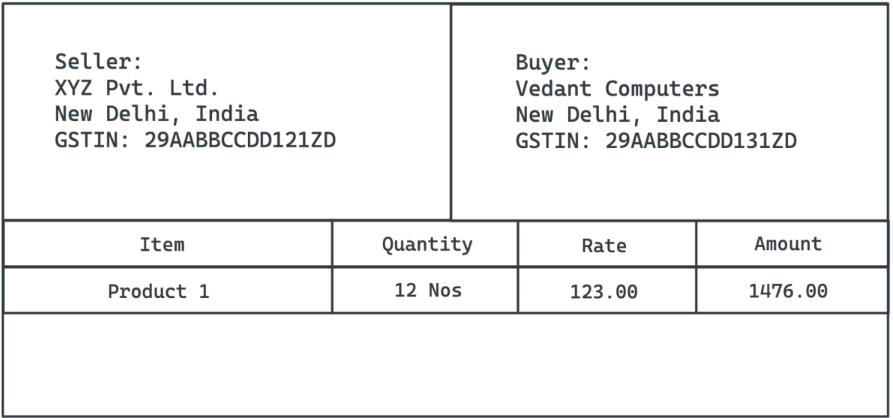
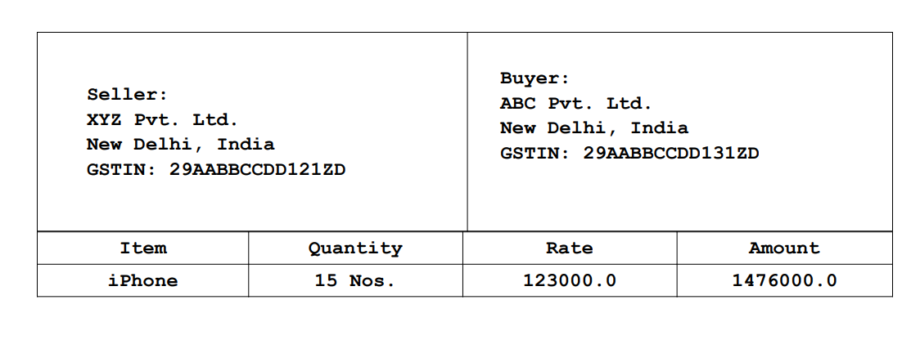

# DynamicPDFGenerator

A Spring Boot Application with REST API to generate PDF using Java Template
Engine.

## Requirement

● REST API to accept data and generate a PDF based on the received data.
● Ability to download the above-generated PDF
● Store the above-generated PDF on the local storage and redownload it when the
same data is provided instead of generating it again.
Use Java Template Engines like Thymeleaf or iText to generate the PDF and store it on
the local storage which can be retrieved later. The input should have a proper schema.

## Example

The request body of the API call looks something like this:

    

This should generate a single-page PDF as below:

    

Note
● Only REST APIs are required. No UI.
● Testable on Postman / Swagger.
● Will prefer properly structured code.
● Will prefer Test Cases (TDD).

## Result

POST Request - <http://localhost:8080/generate>

    

